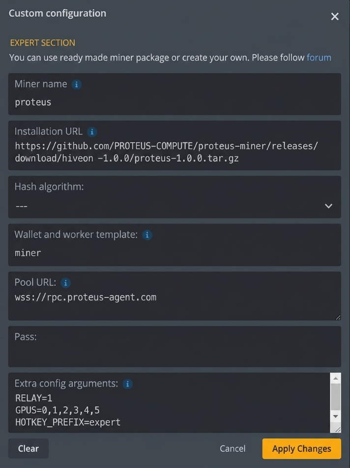

# PROTEUS miner

 &nbsp;  &nbsp; 

Run a PROTEUS **expert** (miner) or **router** (validator) neuron and earn **$PRTS** for useful GPU compute.

PROTEUS is a sovereign Layer-1 chain (a fork of subtensor, mono-token era). It is a decentralized mixture of experts: experts serve inference, the router routes each request to the best expert and scores the answer, and $PRTS emission lands automatically on-chain, proportional to the quality of the work. This is proof of useful work, not proof of hash.

> [!TIP]
> **Why joining early pays more.** Emission is split between the scored experts, so the fewer of them there are, the larger each share is. That is arithmetic, not a promotion: check `SubtensorModule.Incentive(1)` from any node and divide.
>
> Where the emission goes, all of it verifiable on chain: **18%** to the subnet owner (`SubnetOwnerCut` reads 11796 of 65535), and the remaining 82% split evenly between the router and the experts, which is the standard Bittensor validator/miner split rather than a setting of ours. The [experts leaderboard](https://app.proteus-agent.com/) ranks contributors by the quality of their compute.

> **Mainnet is live.** The chain is producing blocks and the public RPC is `wss://rpc.proteus-agent.com`. Follow the steps below to register an expert and start earning.

## Contents

- [Requirements](#requirements)
- [Install](#install)
- [1. Create a wallet](#1-create-a-wallet)
- [2. Register on the network](#2-register-on-the-network)
- [3. Run your expert (Docker, recommended)](#3-run-your-expert-docker-recommended)
  - [Behind a home router / CGNAT](#behind-a-home-router--cgnat)
- [3b. Run your expert (bare metal)](#3b-run-your-expert-bare-metal)
- [4. Multi-GPU hosts and mining rigs](#4-multi-gpu-hosts-and-mining-rigs)
  - [Hiveon flight sheet](#hiveon-flight-sheet)
  - [Any other multi-GPU host](#any-other-multi-gpu-host)
  - [How many cards actually start](#how-many-cards-actually-start)
  - [Preparing a Hiveon host](#preparing-a-hiveon-host)
- [Run a router (validator)](#run-a-router-validator)
- [Inference backend](#inference-backend)
  - [Dev / smoke-test backend (ollama)](#dev--smoke-test-backend-ollama)
- [License](#license)

## Requirements

- **An Nvidia GPU with CUDA.** PROTEUS mining is GPU-only. There is no CPU mining: the task is heavy enough that only Nvidia GPUs are competitive.
- Python 3.10 - 3.12
- Linux (or WSL2 on Windows)

## Install

```bash
git clone https://github.com/PROTEUS-COMPUTE/proteus-miner
cd proteus-miner
pip install -r requirements.txt
```

Or the one-liner:

```bash
curl -sSL https://raw.githubusercontent.com/PROTEUS-COMPUTE/proteus-miner/main/install.sh | bash
```

## 1. Create a wallet

```bash
btcli wallet new-coldkey --wallet.name miner
btcli wallet new-hotkey  --wallet.name miner --wallet.hotkey expert1
```

Keep your coldkey mnemonic safe and offline. It controls your funds.

**Already have a wallet on the web wallet?** Reuse the same account: copy its 12-word phrase from https://app.proteus-agent.com/wallet and regenerate it here as your coldkey, then add a hotkey.

```bash
btcli wallet regen-coldkey --wallet.name miner   # paste your 12 words
btcli wallet new-hotkey    --wallet.name miner --wallet.hotkey expert1
btcli wallet list                                # the address must match your web wallet
```

## 2. Register on the network

First check that your miner can reach the chain:

```bash
btcli subnets list --network wss://rpc.proteus-agent.com
```

Then register your hotkey on the subnet. There are two ways in, and if you are
arriving with an empty wallet you want the first one.

**Proof of work (free).** You pay with compute instead of $PRTS, so it works from
a wallet with a zero balance. This is the normal path for a new miner.

```bash
btcli subnets pow-register --netuid 1 \
  --network wss://rpc.proteus-agent.com \
  --wallet.name miner --wallet.hotkey expert1
```

**Recycle (costs $PRTS).** Instant, but it burns a small amount from your
coldkey, currently around 0.02 $PRTS. Only useful once you already hold some.

```bash
btcli subnets register --netuid 1 \
  --network wss://rpc.proteus-agent.com \
  --wallet.name miner --wallet.hotkey expert1
```

Either way the transaction fee itself is zero. The Windows app uses proof of work
automatically, nothing to choose.

## 3. Run your expert (Docker, recommended)

The compose stack starts vLLM (GPU) + the miner together. You need Docker, the
[NVIDIA Container Toolkit](https://docs.nvidia.com/datacenter/cloud-native/container-toolkit/latest/install-guide.html),
and the wallet from step 1.

```bash
cp .env.example .env      # set MODEL, WALLET_NAME, WALLET_HOTKEY
./run.sh                  # public-IP machine (cloud / dedicated server)
```

### Behind a home router / CGNAT

Most home connections sit behind NAT or carrier-grade NAT and **cannot open an
inbound port**, so the router could never reach your axon directly. Run with the
relay instead: your miner opens an **outbound** tunnel to the public relay, and
publishes the relay endpoint on-chain as its axon. Nothing to open on your box.

```bash
RELAY=1 ./run.sh
```

The launcher derives a stable public port from your hotkey and prints it, e.g.
`axon published at 89.116.27.24:2xxxx`.

To check that you are really reachable, ask your axon to answer:

```bash
curl -s -o /dev/null -w '%{http_code}\n' --max-time 8 \
  -X POST http://89.116.27.24:<your-port>/Synapse -d '{}'
```

`401` is the answer you want: your axon is alive and correctly refusing an
unsigned request. `000` means the port accepts TCP but nothing is behind it,
so the router cannot reach you and you will not be scored.

Do **not** use `nc -zv` for this. It only proves the relay is listening, which
stays true even when your own node is down.

Not sure whether you need the relay? If `./run.sh` works and the dashboard shows
your expert being queried, you don't. If your box is behind CGNAT, use `RELAY=1`.

Logs: `docker compose logs -f miner`. Stop: `docker compose down`.

## 3b. Run your expert (bare metal)

If you prefer running Python directly (you manage vLLM yourself, see below):

```bash
python neurons/miner.py --netuid 1 \
  --subtensor.chain_endpoint wss://rpc.proteus-agent.com \
  --wallet.name miner --wallet.hotkey expert1 \
  --axon.port 8091
```

On a public-IP machine this is enough. Behind NAT/CGNAT, prefer the Docker relay
path above, or publish a reachable endpoint yourself with
`--axon.external_ip <ip> --axon.external_port <port>`.

From there the router queries your expert, scores its answers, and $PRTS emission lands on your hotkey every tempo. Track your expert on the dashboard at https://proteus-agent.com.

## 4. Multi-GPU hosts and mining rigs


**One GPU is one expert.** Each card runs its own vLLM and its own neuron, under
its own hotkey, so it holds its own uid and earns its own share. A single miner
spread across a rig would earn one share; eight cards earn eight.

<br clear="left">

### Hiveon flight sheet

Add PROTEUS as a custom miner, then create a flight sheet:

### ⛏️ Multi-GPU $PRTS mining



| Field | Value |
|---|---|
| Miner name | `proteus`, filled in from the installation URL |
| Installation URL | `https://github.com/PROTEUS-COMPUTE/proteus-miner/releases/download/hiveon-1.0.0/proteus-1.0.0.tar.gz` |
| Hash algorithm | leave as `----`, PROTEUS does not hash |
| Wallet and worker template | your coldkey wallet name, e.g. `miner` |
| Pool URL | `wss://rpc.proteus-agent.com` |
| Pass | leave empty |
| Extra config arguments | see below |

```
RELAY=1            # tunnel each axon out, required behind CGNAT
GPUS=0,1,2         # cards to use, default every card
HOTKEY_PREFIX=expert   # card N uses hotkey <prefix><N+1>
MAX_CARDS=4        # cap regardless of what fits
MODEL=<hf-id>      # force one model, default is sized per card
```

Throughput is reported per card in tokens/s, under the H/s label the dashboard
uses. `Accepted / rejected` is repurposed as reachable / unreachable cards: a card
serving inference nobody can reach earns nothing, so it belongs in the stats.

One hotkey per card, all under the same coldkey:

```bash
for i in 1 2 3 4; do
  btcli wallet new-hotkey --wallet.name miner --wallet.hotkey expert$i
  btcli subnets pow-register --netuid 1 --network wss://rpc.proteus-agent.com     --wallet.name miner --wallet.hotkey expert$i
done
```

Registration is rate limited on-chain to twelve per ~72 minutes; past that the
chain returns `Custom error: 5` and you retry in the next interval.

### Any other multi-GPU host

Without Hiveon, run the launcher directly:

```bash
./rig.sh --plan     # inspect the host, print the plan, start nothing
./rig.sh            # start, RELAY=1 behind CGNAT, GPUS=0,2 for a subset
./rig.sh --down     # stop every stack
```

### How many cards actually start

Host RAM is the binding constraint on a rig, not VRAM, and a containerised vLLM
holds several GB of system memory beyond the weights. The figure depends on the
image, the model and the machine, so it is measured rather than assumed: the first
stack starts alone, its resident memory is measured on that host, and that number
decides how many further cards start. A card that would not fit is skipped with a
reason. Nothing is launched on a promise.

```
09:14:02  host        16 cores, 61440 MB RAM available, 780 GB free for images
09:14:03  gpu 0       RTX 4070 SUPER, Qwen2.5-7B-Instruct-AWQ, hotkey expert1
09:17:41  gpu 0       ready, holding 4118 MB of host RAM
09:31:08  started     6 stack(s), skipped 0
09:31:08  footprint   ~4210 MB host RAM per stack, measured on this host
```

Per card the launcher picks the model from VRAM (3B under 15 GB, 7B under 22 GB,
14B above), the vLLM build that carries kernels for that GPU including RTX
50-series, a pinned device, a distinct axon and relay port, and a shared model
cache so the weights are downloaded once.

### Preparing a Hiveon host

Hiveon is Debian based but ships neither Docker nor the container toolkit:

```bash
apt update && apt install -y docker.io
curl -fsSL https://nvidia.github.io/libnvidia-container/gpgkey   | gpg --dearmor -o /usr/share/keyrings/nvidia-container-toolkit-keyring.gpg
curl -s -L https://nvidia.github.io/libnvidia-container/stable/deb/nvidia-container-toolkit.list   | sed 's#deb https://#deb [signed-by=/usr/share/keyrings/nvidia-container-toolkit-keyring.gpg] https://#g'   > /etc/apt/sources.list.d/nvidia-container-toolkit.list
apt update && apt install -y nvidia-container-toolkit
nvidia-ctk runtime configure --runtime=docker && systemctl restart docker
```

**Do not let any guide update your NVIDIA driver.** Hiveon manages its own and
replacing it breaks the rest of the rig. The toolkit works with the driver already
installed.

Rigs are usually short on host RAM (4-8 GB for eight cards) and on disk (a 32-64 GB
boot drive). Both are reported by `./rig.sh --plan` before anything downloads.
PCIe risers are not a concern: weights load once and inference stays on the card.

## Run a router (validator)

```bash
python neurons/validator.py --netuid 1 \
  --subtensor.chain_endpoint wss://rpc.proteus-agent.com \
  --wallet.name validator --wallet.hotkey default
```

## Inference backend

Experts serve model inference on an Nvidia GPU via **vLLM** (CUDA). This is the
only production-supported backend. Install the vLLM build that matches your
CUDA version, then start the server before the miner:

```bash
python -m vllm.entrypoints.openai.api_server --model meta-llama/Meta-Llama-3.1-8B-Instruct
```

The miner connects to `http://localhost:8000` by default. Override with the
`VLLM_HOST` and `MODEL_NAME` environment variables.

```bash
VLLM_HOST=http://localhost:8000 MODEL_NAME=meta-llama/Meta-Llama-3.1-8B-Instruct \
  python neurons/miner.py --netuid 1 ...
```

### Dev / smoke-test backend (ollama)

For local development only, you can point the miner at a local
[Ollama](https://ollama.com) instance with `--expert.backend ollama`:

```bash
python neurons/miner.py --expert.backend ollama --netuid 1 ...
```

This lets you run the full reward loop end-to-end without an Nvidia GPU. It is
**dev / smoke-test only**: ollama on CPU is far too slow to be competitive on
mainnet, the latency factor will tank your reward, and you will earn ~0. Do not
use it as a production path.

## License

MIT.
